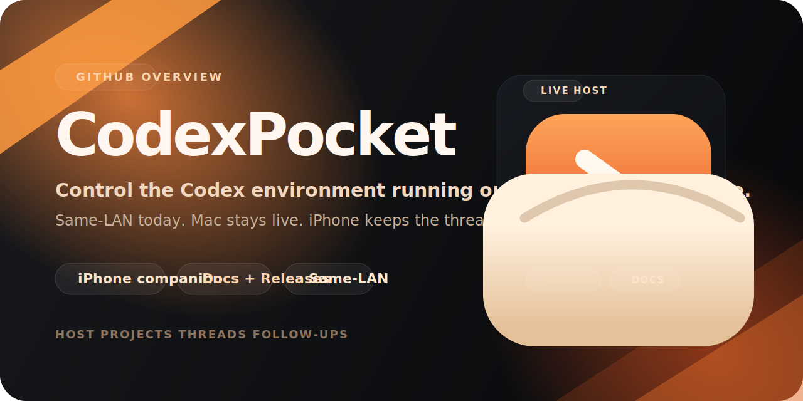

  

# CodexPocket

Mac 上で動く Codex を、iPhone からそのまま扱うための companion です。  
CodexPocket is an iPhone companion for the Codex environment running on your Mac.

Today the public surface is intentionally small and focused:

- keep the Codex runtime on your Mac
- open the same Host, Project, and Thread from iPhone
- send a quick follow-up or read the result away from your desk
- stay on the same local network for the current release

## Start Here

- Documentation: [codex-pocket-docs](https://github.com/codex-pocket/codex-pocket-docs)
- Public docs site: [codex-pocket.github.io/codex-pocket-docs](https://codex-pocket.github.io/codex-pocket-docs/)
- Downloads: [codex-pocket-releases](https://github.com/codex-pocket/codex-pocket-releases/releases)

## Public Repositories

| Repository | Purpose |
| --- | --- |
| [`codex-pocket-docs`](https://github.com/codex-pocket/codex-pocket-docs) | Official documentation, setup guides, troubleshooting, and the Docusaurus site |
| [`codex-pocket-releases`](https://github.com/codex-pocket/codex-pocket-releases) | Downloadable release artifacts, checksums, and Sparkle appcast assets |

## Scope Today

- Same-LAN Mac and iPhone setup
- Mac remains the runtime host
- iPhone acts as the remote companion for follow-ups and reading results
- Public guidance is maintained in both Japanese and English
